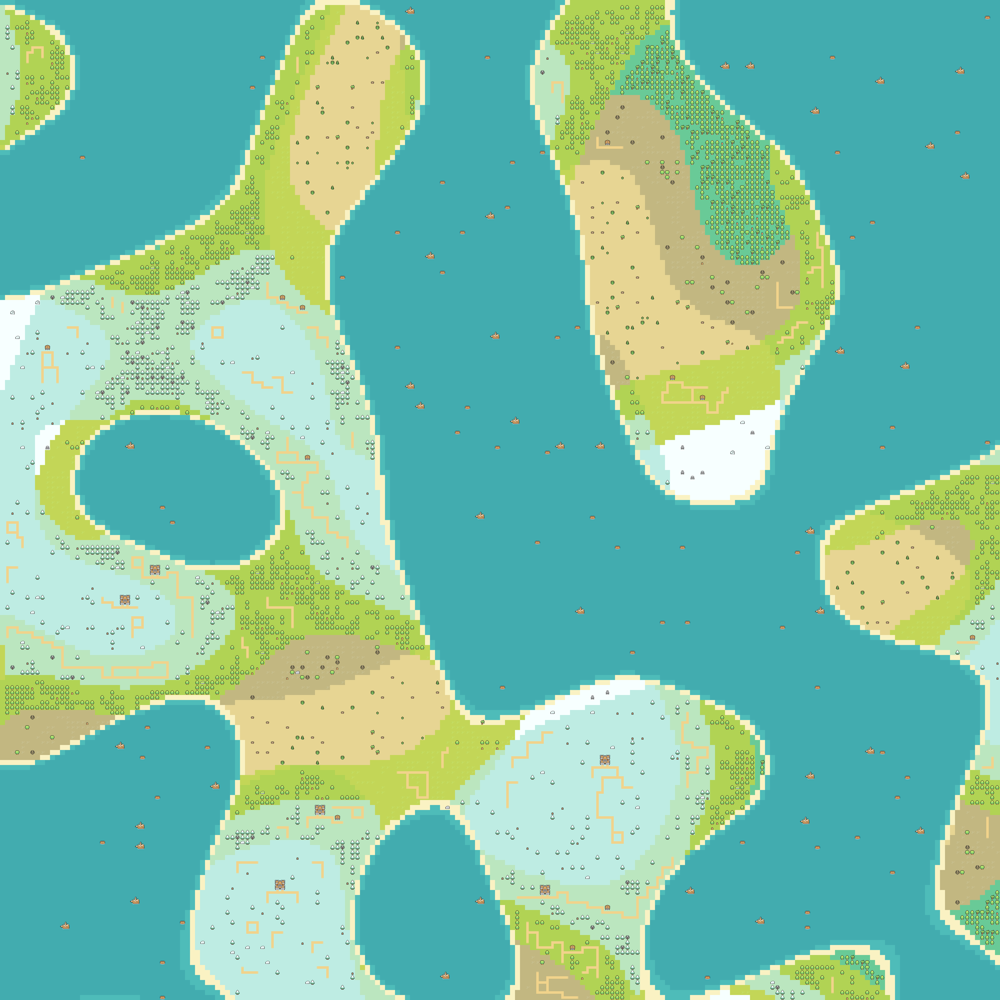
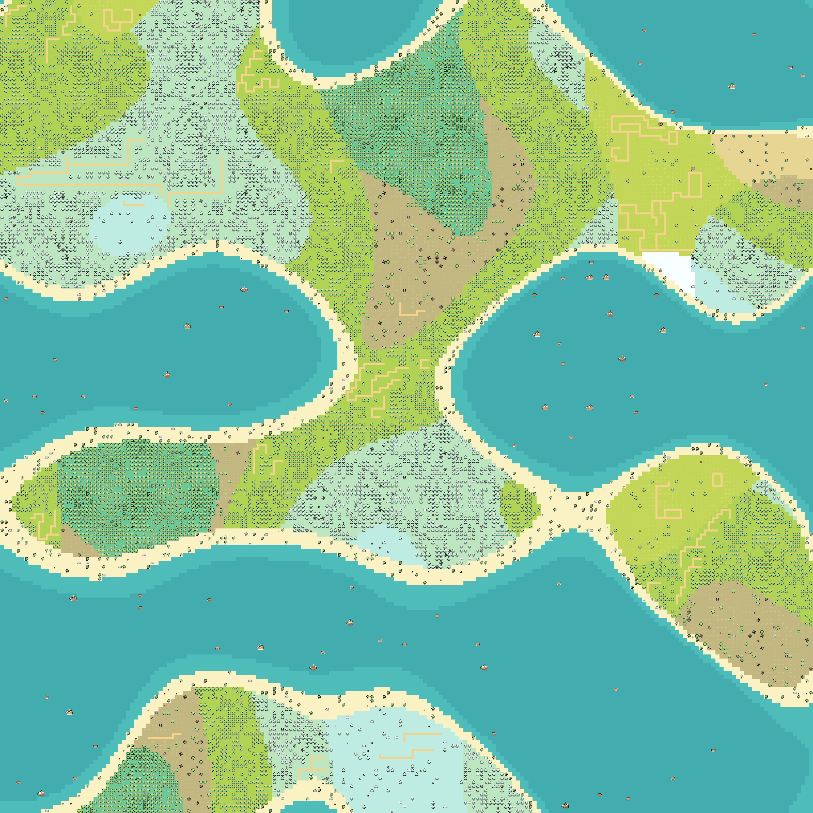
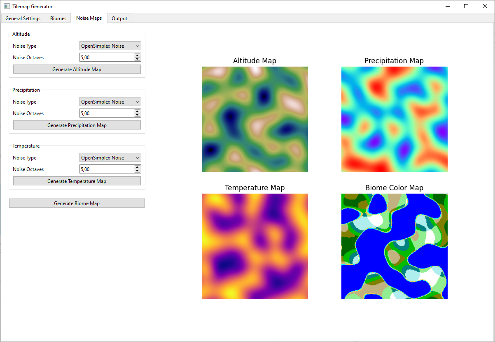

# Procedural 2D Tilemap Generator

## Project Overview

This project implements a **procedural 2D tilemap generator with a graphical user interface**, written in Python. The
application generates rectangular tilemaps composed of multiple biomes, based on a combination of **noise functions**
(Perlin noise and OpenSimplex noise) and a **modified Wave Function Collapse (WFC)** algorithm.

The generator takes **rectangular sample tilemaps for individual biomes** as input and produces a larger output tilemap
in which these biomes are distributed according to **configurable environmental parameters** (altitude, precipitation,
and temperature). These parameters are derived from noise maps whose settings can be interactively adjusted by the user.

## Example Outputs

### Example 1 – Simple Tiled WFC with Perlin Noise



- Output size: 200×200 tiles
- WFC mode: Simple Tiled
- Noise type: Perlin

### Example 2 – Overlapping WFC with OpenSimplex Noise



- Output size: 200×200 tiles
- WFC mode: Overlapping
- Noise type: OpenSimplex

## User Interface



This screenshot shows the Noise Maps component of the graphical user interface.

## Usage Guide

This section provides a concise step-by-step guide for creating a tilemap using the tilemap generator.

### 1. External Preparation

Before starting the application, the following assets must be prepared:

- A **tileset image**  
  This has to be in **PNG or JPEG format** and can be downloaded from the internet or created or edited using suitable
  tools such as the _Tiled Editor_.

- A **biome sample tilemap** for each desired biome  
  Each sample should be a relatively small tilemap and must be saved in **CSV format**, containing the tile IDs used in
  the tileset.  
  The _Tiled Editor_ can also be used for this step, as long as the same tileset image is imported there.

### 2. General Settings Component

- Import the tileset image prepared in step 1 and configure the correct tile width and height.
- Set the desired width and height of the output tilemap.
- Enable or disable the noise maps (altitude, precipitation and temperature) used for biome assignment and configure
  their minimum and maximum possible values.

### 3. Biomes Component

- Create all required biomes and import the corresponding biome samples from step 1.
- For each biome, configure:
  - Name
  - Color representation
  - Minimum and maximum values for all enabled noise maps

Care must be taken to ensure that, for any possible combination of parameter values, **exactly one biome applies**, if
possible.

### 4. Noise Maps Component

- For each enabled noise map, configure:
  - Noise type (Perlin noise or OpenSimplex noise)
  - Number of octaves
- Generate the noise maps and inspect them visually.
- Generate the **biome map**, which assigns a biome to each cell of the output tilemap and displays this assignment
  using the biome color representations.

These steps can be repeated until the biome distribution matches the desired result.

### 5. Output Component

- Configure the Wave Function Collapse settings, such as:
  - WFC mode
  - Segment size
  - Cell and segment order heuristics
- Choose an animation mode for visualizing the generation process.
- Start the generation of the output tilemap.
- Once generation is complete, save the result:
  - As a **CSV file** containing tile IDs, or
  - As a **PNG image** of the generated tilemap.

## Installation

### Requirements

- Python 3.12
- pip

### Setup (Linux / macOS)

```bash
git clone https://github.com/vnachname/tilemap-generator.git
cd tilemap-generator

python3.12 -m venv .venv
source .venv/bin/activate

pip install -r requirements.txt
python src/main_app.py
```

### Setup (Windows)

```bash
git clone https://github.com/vnachname/tilemap-generator.git
cd tilemap-generator

py -3.12 -m venv .venv
.venv\Scripts\activate

pip install -r requirements.txt
python src/main_app.py
```

## References & Credits

- Maxim Gumin, _Wave Function Collapse Algorithm_  
   https://github.com/mxgmn/WaveFunctionCollapse

  This project implements an independent Python-based variant of the Wave Function Collapse algorithm inspired by the
  original concept.

- Shade, _16x16 Mini World Sprites_  
  https://merchant-shade.itch.io/16x16-mini-world-sprites

  The [example_tileset](assets/tilesets/example_tileset.png) used in this project was assembled from this tileset.

## Third-Party Libraries

This project uses the following open-source Python libraries:

- PyQt6
- NumPy
- Matplotlib
- Pillow
- perlin-noise
- opensimplex
- psutil

## License

This project is licensed under the MIT License - see the LICENSE.md file for details.
